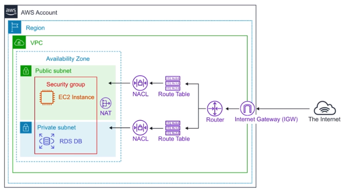

# Technology Overview #

## AWS Organizations and Accounts ##

* **Organizations** = allow you to centrally manage billing, control access, compliance, security and share resources across AWS accounts.
* **Root User Account** = is a single sign-in identity that has complete access to all AWS services and resources in an account. Each account has one *Root User*.
* **Organization Units** = are a group of AWS accounts within an organization which can also contain other organization units, creating a hierarchy.
* **Service Control Policies** = give central control over the allowed permissions for all the accounts in an organization, helping to ensure the respect of the guidelines.

## AWS Networking ##

* **Region** = geographical location of the network where you launch your resources
* **VPC** = a logically isolated section of AWS cloud where you can launch AWS resources
* **AZ** = data center of AWS resources
* **Subnet** = logical partition of an IP network, into multiple, smaller network segments. Can be public (accessible from internet) or private. You launch the resources in a subnet.
* **Internet Gateway** = enable the access to internet from your VPC
* **Route Tables** = determine where network traffic is directed from your subnets
* **Network Access Control List (NACL)** = act as a firewall at the subnet level
* **Security Group** = act as a firewall at instance level

## Database Services ##

* **DynamoDB**, NoSQL key/value database (like Cassandra)
* **DocumentDB**, NoSQL Document database, MongoDB compatible
* **RDS**, Relational Database Service that supports multiple engines (MySQL, Postgres, MariaDB, Oracle, MS SQL Server, Aurora)
  * *Aurora MySQL* (5x faster), database fully managed
  * *Aurora Serverless*, only runs when needed, like Lambda
* **Neptune**, managed Graph database
* **Redshift**, Columnar database, petabyte warehouse
* **ElastiCache**, Redis or Memcache database

## Provisioning Services ##

Provisioning is the allocation or creation of resources and services to a customer, in an automated way.

* **Elastic Beanstalk**, service for deploying and scaling web application and services developed with Java, .NET, PHP, Node.js, Python, Ruby, Go, Docker
* **OpsWorks**, configuration management service that provides managed instances of Chef and Puppet
* **CloudFormation**, Infrastracture As Code, JSON or YAML
* **AWS QuickStart**, pre-made packages that can launch and configure your AWS compute, network, storage and other services required to deploy on AWS
* **AWS Marketplace**, digital catalogue of thousands of software listing from independent software vendors; you can use it to find, buy, test and deploy software

## Computing Services ##

* **EC2**, Elastic Compute Cloud, highly configurable servers (CPU, memory, network, OS)
* **ECS**, Elastic Container Service, highly scalable, high-performance container orchestration service that supports Docker containers; you pay for the EC2 instances
* **Fargate**, you define your microservices and you don't think about the infrastracture.
* **EKS**, Elastic Kubernetes Service, easy to deploy, manage and scale containerized application using Kubernetes
* **Lambda**, serverless functions that run the code without provisioning or managing servers. You pay only for the compute time used
* **Elastic Beanstalk**, orchestrates various AWS services, including EC2, S3, SNS (Simple Notification Service), CloudWatch, autoscaling and Elastic Load Balancers
* **AWS Batch**, plans, schedules and executes your batch computing workloads across the full range of AWS compute services (basic EC2 instances or Spot)

## Storage Services ##

* **S3**, Simple Storage Service, for storing objects (hard drive in the cloud)
* **S3 Glacier**, low cost storage for archiving and long-term backup
* **Storage Gateway**, hybrid cloud storage with local caching
* **EBS**, *Elastic Block Storage*, hard drive in the cloud you attach to EC2 instances
* **EFS**, *Elastic File Storage*, file storage mountable to multiple EC2 instances at the same time
* **Snowball**, physically migrate lots of data via computer suitcase (50-80 TB)
  * **Snowball Edge**, better version (100 TB)
  * **Snowmobile**, Shipping container, pulled by a semi-trailer truck (100 PB)

## Business Centric Services ##

* **Amazon Connect** = Call Center, it's a cloud based Call Center you can setup in few clicks; it's based on the same system used by Amazon customer service teams
* **WorkSpaces** = Virtual Remote Desktop, it's a secure managed service for provisioning either Windows or Linux desktops which can scale up quickly
* **WorkDocs**, like Sharepoint, it's a content creation and collaboration service
* **Chime**, AWS Platform for online meetings, video conferencing
* **WorkMail**, managed business email, contacts, calendar service
* **Pinpoint**, marketing campaign management system you can use for sending targeted email, SMS, notifications
* **SES**, *Simple Email Service*, cloud based email sending service designed for marketers and developers to send markerting emails
* **QuickSight**, a Business Intelligence service, that connects multiple datasource and quickly visualize data in form of graphs

## Enterprise Integration ##

It's all about going hybrid.

* **Direct Connect**, dedicated Gigabit network connection from premises to AWS
* **VPN**, establish a secure connection to your AWS network
  * Site-to-Site VPN, connecting on-premise to AWS network
  * Client VPN, connecting a single laptop to AWS network
* **Storage Gateway**, a hybrid storage service that enables the on-premises application to use AWS storage.
* **Active Directory**, the AWS directory service for Microsoft Active Directory. Enables your directory-aware workloads and AWS resources to use managed Active Directory in the AWS Cloud.

## Logging Services ##

* **CloudTrail**, logs all the API calls between AWS services (Who created this bucket?, Who spun up this EC2 instance?). It helps detect misconfigurations, detect malicious actors and automate responses.
* **CloudWatch**, is a collection of multiple services:
  * **Logs**, performance data about AWS services
  * **Metrics**, time-ordered set of data points, some variable to monitor
  * **Events**, trigger events based on conditions
  * **Alarms**, trigger notifications base on metrics
  * **Dashboard**, create visualization based on metrics
